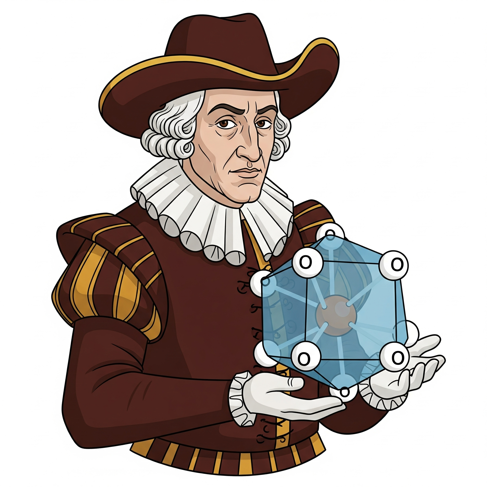

# LordCapulet



**LordCapulet** is an AiiDA plugin that provides automated workflows for constrained DFT+U calculations using OSCDFT (Oxidation-State Constrained DFT). The plugin enables systematic exploration of electronic ground states in strongly correlated materials, with intelligent sampling algorithms and comprehensive analysis tools.

## Key Features

### Core Workflows

#### GlobalConstrainedSearchWorkChain
The flagship workflow that orchestrates an automated search process:

1. **Initial AFM Search**: Performs antiferromagnetic calculations to generate initial occupation matrices
2. **Iterative Constrained Search**: Intelligently proposes new occupation matrices based on previous results
3. **Batch Processing**: Runs N proposals per generation until Nmax total calculations are completed
4. **Adaptive Sampling**: Uses both Markovian (generation-to-generation) and holistic (all-history) proposal modes

```
                    GlobalConstrainedSearchWorkChain
                              │
                              ▼
                    ┌─────────────────────┐
                    │   AFMScanWorkChain  │
                    └─────────┬───────────┘
                              │
              ┌───────┬───────┼───────┬───────┐
              ▼       ▼       ▼       ▼       ▼
            [AFM1]  [AFM2]  [AFM3]  [AFM4]  [AFM5]
              │       │       │       │       │
              └───────┴───┬───┴───────┴───────┘
                          ▼
                    ┌─────────────┐
                    │  Propose    │◄─── Generation 0 Results
                    │  Matrices   │
                    └──────┬──────┘
                           │
    ┌──────────────────────┼──────────────────────┐
    │                      ▼                      │
    │           ConstrainedScanWorkChain          │
    │                      │                      │
    │    ┌─────────┬─────────┼─────────┬─────────┐    │
    │    ▼         ▼         ▼         ▼         ▼    │
    │ [OSCDFT1] [OSCDFT2] [OSCDFT3] [OSCDFT4] [OSCDFT5] │
    │    │         │         │         │         │    │
    │    └─────────┴─────┬───┴─────────┴─────────┘    │
    │                    ▼                            │
    │              ┌─────────────┐                    │
    │              │  Propose    │◄─── Generation 1   │
    │              │  Matrices   │                    │
    │              └──────┬──────┘                    │
    │                     │                          │
    │          ConstrainedScanWorkChain               │
    │                     │                          │
    │ ┌─────────┬─────────┼─────────┬─────────┐       │
    │ ▼         ▼         ▼         ▼         ▼       │
    │[OSCDFT6] [OSCDFT7] [OSCDFT8] [OSCDFT9] [OSCDFT10]│
    │ │         │         │         │         │       │
    │ └─────────┴─────┬───┴─────────┴─────────┘       │
    │                 ▼                               │
    │           ┌─────────────┐                       │
    │           │    ...      │◄─── Continue until    │
    │           │  (N times)  │     Nmax reached      │
    │           └─────────────┘                       │
    └─────────────────────────────────────────────────┘

    Key: [AFM1-5] = AFM calculations discovering magnetic configurations
         [OSCDFT1-N] = Constrained DFT calculations (OSCDFT = Oxidation-State 
                      Constrained DFT) with specific target occupation matrices
         Each generation proposes N new matrices from previous results
```

#### AFMScanWorkChain & ConstrainedScanWorkChain
- **AFMScanWorkChain**: Systematic scanning of ferro-antiferromagnetic configurations
- **ConstrainedScanWorkChain**: Batch execution of constrained DFT calculations with OSCDFT
- **ConstrainedPWCalculation**: Custom PW calculation plugin with OSCDFT constraint handling


## Installation
```bash
git clone `git@github.com:alberto-carta/aiida-LordCapulet.git`
cd aiida-LordCapulet
pip install -e .
```

## Usage

### Import
```python
from lordcapulet import ConstrainedPWCalculation, AFMScanWorkChain, ConstrainedScanWorkChain, GlobalConstrainedSearchWorkChain
```

### Using AiiDA Entry Points
```python
from aiida.plugins import WorkflowFactory, CalculationFactory

GlobalConstrainedSearchWorkChain = WorkflowFactory('lordcapulet.global_constrained_search')
ConstrainedPWCalculation = CalculationFactory('lordcapulet.constrained_pw')
```

### Running a Global Constrained Search

#### Basic Usage
```python
from aiida.engine import submit
from lordcapulet.workflows import GlobalConstrainedSearchWorkChain

inputs = {
    'afm': {
        'structure': hubbard_structure,
        'parameters': pw_parameters,
        'kpoints': kpoints,
        'code': code,
        'tm_atoms': List(list=tm_atoms),
        'walltime_hours': Float(2.0),  # AFM calculations walltime
    },
    'constrained': {
        'structure': hubbard_structure,
        'parameters': pw_parameters,
        'kpoints': kpoints,
        'code': code,
        'tm_atoms': List(list=tm_atoms),
        'oscdft_card': oscdft_parameters,
        'walltime_hours': Float(4.0),  # Constrained calculations walltime
    },
    'Nmax': Int(500),  # Total number of proposals to evaluate
    'N': Int(60),      # Number of proposals per generation
    
    # Optional: Global walltime override
    # 'afm_walltime_hours': Float(1.5),        # Override AFM walltime
    # 'constrained_walltime_hours': Float(3.0), # Override constrained walltime
}

workchain = submit(GlobalConstrainedSearchWorkChain, **inputs)
```

#### Analysis & Visualization
```python
# Extract workchain data with source tagging
from examples.gather_workchain_data import gather_workchain_data
data = gather_workchain_data(workchain_pk=your_workchain_pk)
```

See `examples/` directory for complete working examples including UO2, NiO, and FeO systems.

## Verification

Check that the plugins are properly registered:
```bash
verdi plugin list aiida.calculations | grep lordcapulet
verdi plugin list aiida.workflows | grep lordcapulet
```

After installation, restart the AiiDA daemon:
```bash
verdi daemon restart
```

## Documentation

- `docs/global_constrained_search.md` - Detailed workflow documentation
- `docs/gather_workchain_data.md` - Data extraction and analysis guide  
- `docs/source_tagging.md` - Understanding calculation source identification
- `examples/` - Complete working examples for various materials

## Testing

Run the test suite to verify functionality:

```bash
# Simple test runner (no dependencies)
python run_tests.py

# With pytest (if installed)
pytest tests/
```

See `tests/README.md` for detailed testing information.

## Requirements

- Python >= 3.8
- AiiDA >= 2.0.0
- aiida-quantumespresso >= for now personal fork
- numpy
- pytorch

## Repository Structure

```
lordcapulet/                          # Main package directory
├── calculations/                     # AiiDA calculation plugins
│   ├── constrained_pw.py            # Custom PW calculation with OSCDFT constraints
│   └── __init__.py                  # Module initialization
├── functions/                        # AiiDA calcfunction plugins
│   ├── __init__.py                  # Module initialization
│   └── propose.py                   # Functions for proposing occupation matrices
├── utils/                           # Utility functions and helpers
│   └── __init__.py                  # Module initialization
└── workflows/                        # AiiDA workflow plugins
    ├── afm_scan.py                  # Antiferromagnetic configuration scanner
    ├── constrained_scan.py          # Multiple constrained calculations workflow
    ├── global_constrained_search.py # Global automated search workflow
    └── __init__.py                  # Module initialization

docs/                                # Documentation
├── gather_workchain_data.md         # Data extraction guide
├── global_constrained_search.md     # Main workflow documentation
└── source_tagging.md               # Source identification guide

examples/                            # Working examples and analysis tools
├── FeO.scf.in, NiO.scf.in          # Input structures
├── gather_workchain_data.py         # Data extraction script
├── plot_workchain_data.py           # Visualization script  
├── submit_global_search.py          # Main submission example
└── *.json, *.png                   # Example data and plots

tests/                               # Test suite
└── test_*.py                       # Unit tests for all components
```

